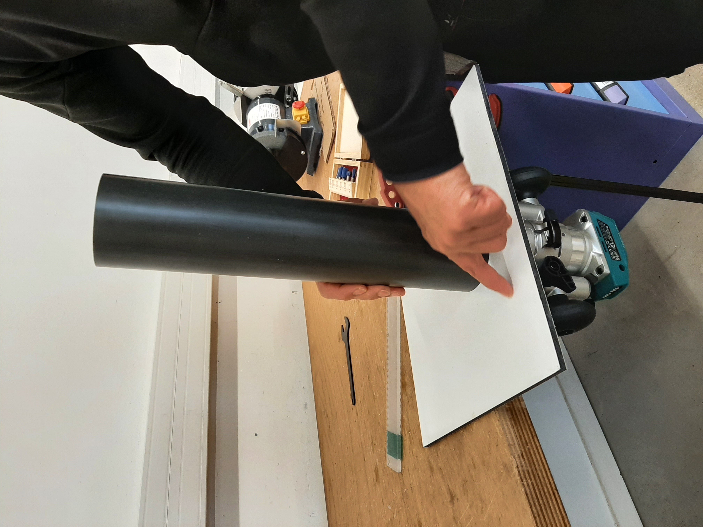

# Module 2 : Caisson CTD

Notez que BlueRobotics propose de bons boîtiers étanches, voir par exemple (https://bluerobotics.com/store/watertight-enclosures/wtevp/# tube) , mais le prix est assez élevé. Nous avons conçu un boîtier rapide et facile à construire qui ne nécessite que peu d'outils à l'exception d'un lasercut et d'une imprimante 3D (que l'on peut trouver dans la plupart des Fablabs voir : https://www.fablabs.io/labs/map).

-> Le corps de l'enceinte est constitué d'un tube PVC standard (européen) à pression (63mm, épaisseur 4.7). Chaque capuchon est constitué de 2 « disques » de PMMA (plexiglas) d'une épaisseur de 10mm comme illustré ci-dessous. Les deux disques des capuchons des capteurs sont maintenus ensemble avec les capteurs BAR30 et FastTemp, un filetage M10 a été réalisé dans le disque PMMA intérieur.&#x20;

\
Caisson conçu pour les sondes CTD.

### Compétences requises

* Découpeuse laser
* Imprimante 3D
* Affleureuse
* Taraudage

## Matériel

| 0,25 | [Plaque plexiglass épais. 10mm transparent, L. 50cm x H. 30cm](https://plaqueplastique.fr/product/plaque-plexiglass-xt-10mm-transparent/)                                                                                                                                                                                                                 |
| ---- | --------------------------------------------------------------------------------------------------------------------------------------------------------------------------------------------------------------------------------------------------------------------------------------------------------------------------------------------------------- |
| 2    | [Joint torique, Ø int. 52mm, Ø ext. 60mm, épais. 4mm](http://fr.rs-online.com/web/p/joints-et-joints-toriques/1965129)                                                                                                                                                                                                                                    |
| 1    | [Joint torique, Ø int. 12mm, Ø ext. 16mm, épais. 2mm](https://fr.rs-online.com/web/p/joints-et-joints-toriques/1964869?gb=a)                                                                                                                                                                                                                              |
| 3    | [Écrou borgne M4, inox A4 316](https://www.vis-express.fr/ecrou-borgne-inox-a4-din-1587-vs0100/37773-2559648-ecrou-borgne-m4-inox-a4.html#/267-conditionnement-200_pieces)                                                                                                                                                                                |
| 3    | [Écrou à oreilles M4, inox A4 316](https://fr.rs-online.com/web/p/ecrous-a-oreilles/2484315?gb=s)                                                                                                                                                                                                                                                         |
| 2    | [Vis à tête cylindrique pozi M3 x L. 20mm, inox A4 316](https://fr.rs-online.com/web/p/vis-a-metaux/0190478?gb=s)                                                                                                                                                                                                                                         |
| 6    | [Vis à tête cylindrique pozi M3 x L. 10mm, inox A4 316](https://fr.rs-online.com/web/p/vis-a-metaux/0190440?gb=s)                                                                                                                                                                                                                                         |
| 1    | [Tige filetée M4 x L. 1m, inox A4 316](https://www.vis-express.fr/tige-filetee-longueur-1-metre-inox-a4-din-975vs3347vs0104/21608-tige-filetee-m4-longueur-1-metre-inox-a4.html)                                                                                                                                                                          |
| 1    | [Tube PVC PN16, Ø ext. 63mm, épais. 4,7mm](https://connexion-pression.com/tubes-rigides-pvc-pression/63-915-tube-d-63-pn16-pvc-pression.html#/13-taille_de_la_decoupe-decoupe_1_metre)                                                                                                                                                                    |
| 4    | Colliers de serrage nylon 4,8mm x 300mm                                                                                                                                                                                                                                                                                                                   |
| 0,1  | [Filament 3D PETG 1kg noir 1,75 mm](https://eu.store.bambulab.com/fr/products/petg-hf?id=49068714754396)                                                                                                                                                                                                                                                  |
| 2    | [Vis à tête hexagonale M8 x L. 40mm, inox A4 316](https://www.vis-express.fr/vis-metaux-tete-hexagonale-th-inox-a4-din-933/20979-2322303-vis-metaux-tete-hexagonale-th-m8x40-inox-a4.html?_gl=1*1kk97gb*_up*MQ..*_gs*MQ..\&gclid=Cj0KCQiA_NC9BhCkARIsABSnSTarAGtmwjGLn0YNz8O_tkDtvD-51bRM3g7qLIVmRQDK-fGx2-1gUb4aAhp9EALw_wcB#/conditionnement-30_pieces) |
| 0,1  | [Graisse silicone pour joints toriques](https://fr.rs-online.com/web/p/graisses/0494124)                                                                                                                                                                                                                                                                  |

## Outils

* Imprimante 3D
* Découpeuse laser
* Scie à métaux
* Tarauds M3 et M10
* Tournevis cruciformes
* Pince plate ou multiprise
* Pistolet à colle
* Clé plate 7 et 8 mm
* Perceuse + foret de 2,5 mm
* Fraise à chanfreiner à 45° avec roulement
* Graisse

### Vue d'ensemble du caisson

<figure><figcaption></figcaption></figure>

## **Pièces**

<figure><figcaption></figcaption></figure>

### **Étape 1 : Impression 3D**

À l'aide d'une imprimante 3D, de filament PLA ou PETG et des fichiers ci-dessous, imprimez les pièces 28 et 29 à 15% de remplissage.&#x20;

* ​[PCB\_Support.stl](https://github.com/astrolabe-expeditions/LittObs_OSOLAMOS/tree/5120c5b76e9a005e6e9b74700a093cbc68596c3f/hardware/enclosures/box_elec)​
* ​[PCB\_Holder.stl](https://github.com/astrolabe-expeditions/LittObs_OSOLAMOS/tree/5120c5b76e9a005e6e9b74700a093cbc68596c3f/hardware/enclosures/box_elec)

Imprimer également la pièce 31 avec un remplissage plus élevé (>30%) et avec du filament PETG pour plus de résistance car elle sera soumise à plus d'efforts mécaniques.

* ​[Sensor\_protection.stl](https://github.com/astrolabe-expeditions/LittObs_OSOLAMOS/tree/5120c5b76e9a005e6e9b74700a093cbc68596c3f/hardware/enclosures/box_elec)

Imprimer également les 2 support qui permettront de fixer la sonde sur la ligne de mouillage (étant donné qu'il y a 2 fixations, les 3 pièces ci-dessous sont à imprimées en 2 exemplaires) :&#x20;

* [Fixation\_capot\_fermeture.stl](../hardware/enclosures/Fixation_capot_fermeture.stl)
* [Fixation\_charniere.stl](../hardware/enclosures/Fixation_charniere.stl)
* [Fixation\_corps.stl](../hardware/enclosures/Fixation_corps.stl)
* [Fixation\_molette.stl](../hardware/enclosures/Fixation_molette.stl)

## **Étape 2 : Découpe laser**

À l'aide d'une découpeuse laser et des fichiers ci-dessous, découpez les pièces 23, 24, 25 et 26 sur une plaque de plexiglas de 10mm.&#x20;

* ​[PMMA\_Caps\_TD.svg](https://github.com/astrolabe-expeditions/LittObs_OSOLAMOS/tree/5120c5b76e9a005e6e9b74700a093cbc68596c3f/hardware/enclosures/box_elec)

_<mark style="color:$info;">**Réglages de la découpeuse laser Trotec**</mark>_\
&#xNAN;_<mark style="color:$info;">\* pour la gravure :</mark>_\
&#xNAN;_<mark style="color:$info;">Matériau : PMMA / Puissance : 90 / Vitesse : 28/ Fréquence : 1000PPI</mark>_\
&#xNAN;_<mark style="color:$info;">\* pour la découpe :</mark>_\
&#xNAN;_<mark style="color:$info;">Matériau : PMMA 10mm / Puissance : 100 / Vitesse : 0.10 / Fréquence : 8000Hz</mark>_

## **Étape 3 : Perçage et taraudage des bouchons**

* À l'aide d'un taraud M3, taraudez les 4 trous extérieurs de la pièce 24. Faites de même pour les 2 plus trous trous avec un taraud M10 (qui viendront accueillir l'interrupteur étanche et le presse étoupe).
* A l'aide d'un forêt 2.5mm, percez 2 trous dans la pièce 25 à l'emplacement des 2 croix gravées par la découpeuse laser. Ces trous ne doivent pas être traversants et sont d'une profondeur d'au moins 5 mm (idéalement un plus plus que la moitié de l'épaisseur totale du plexiglas).\
  À l'aide d'un taraud M3, taraudez les 2 trous venant d'être percés dans la pièce 25.
* Aucun taraudage n'est nécessaire pour les pièces 23 et 26

<figure><figcaption></figcaption></figure> <figure><figcaption></figcaption></figure>

<figure><figcaption>
Perceuse à colonne à utiliser pour percer la pièce 25 avec un forêt 2,5 mm
</figcaption></figure>

## **Étape 4 : Assemblage des bouchons**

Pour assembler le bouchon avant, superposez la pièce 24 sur la pièce 23 en alignant bien les trous centraux puis placez un joint taurique (27) à la jonction entre les deux pièces.

<figure><figcaption></figcaption></figure> <figure><figcaption></figcaption></figure>

Vissez ensuite les 2 capteurs de pression et température dans les trous de la pièce 23 (paroi extérieure du bouchon):

<figure><figcaption></figcaption></figure>

A l'aide de petites vis M3 de 10mm, vissez le gros support précédemment imprimé (29) à la paroi arrière du bouchon (24)&#x20;

<figure><figcaption></figcaption></figure> <figure><figcaption></figcaption></figure>

Assembler maintenant le second bouchon à l'aides des pièces 25, 26, 27 et 28 et de 2 petites vis M3.

<figure><figcaption></figcaption></figure> <figure><figcaption></figcaption></figure>

Caler et visser la carte électronique à la grande cale (29) à l’aide de 2 petites vis M3 et éventuellement de 2 écrous.

<figure><figcaption></figcaption></figure>

## **Étape 5 : Découpe et chanfrein du tube**

Dans un tube en PVC PN16 de 63mm de diamètre, découpez une portion de 25cm et chanfreiner les deux extrémités intérieures du tube à l'aide d'une fraise à chanfreiner à 45° avec roulement. Le tranchant de la fraise doit ressortir d'environ 4-5 mm de telle sorte à ce que le chanfrein soit suffisant sans pour autant venir complètement manger le bord extérieur.

<figure><figcaption></figcaption></figure> <figure><figcaption></figcaption></figure>

Découper également les tiges filetées en fixant la tige reçue de & mètre dans un étau (avec des cales en bois pour la protéger). Découper cette tige en 3 morceaux égaux d'environ 33cm à l'aide d'une scie à métaux. Au besoin, limer les extrémités avec une lime à métaux pour faciliter l’insertion des écrous à oreilles.

\
 (1).jpg>)

## **Étape 6 : Assemblage du tube**

Placer les deux supports de fixation de sonde sur le tube.

Visser des écrous borgnes M4 à une des extrémités de chacune des 3 tiges filetés (20).

Glisser la pièce 31 (protection de capteurs) par l'autre extrémité des tiges filetés et faites la glisser jusqu'aux écrous borgnes.&#x20;

<figure><figcaption></figcaption></figure>

Faites glisser l'assemblage bouchon avant + carte électronique dans les tiges filetés.&#x20;

Faites glisser le tube et les supports de fixation le long des tiges filetés.&#x20;

Emboiter le bouchon arrière (25, 26, 27.b et 28) à l'extrémité du tube et sur les tiges filetés.

Bloquer le tout en vissant les 3 écrous papillon 
